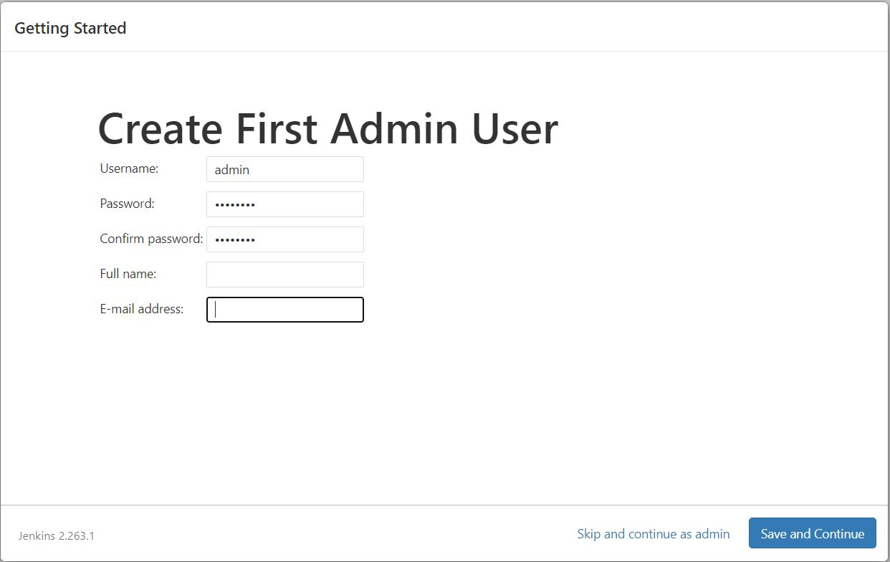

# Installing Jenkins on Windows

- This chapter covers the Jenkins installation process on different environments like Windows, Linux and Docker containers and discusses the hardware/software requirements.

## Step-00: System Requirements

### Hardware requirements

- 256MB of RAM
- 1 GB hard disk space (If you are running Jenkins as a Docker container, 10GB is recommended.)

### Software requirements

- **Java**
  - Java 17 OR java-17-amazon-corretto.x86_64
  - You may download it from this official download link: https://www.oracle.com/in/java/technologies/downloads/
- **Operating system**
  - [Windows](https://www.jenkins.io/doc/book/installing/windows/)
  - [Linux](https://www.jenkins.io/doc/book/installing/linux/)
  - [MacOS](https://www.jenkins.io/doc/book/installing/macos/)
  - [Docker](https://www.jenkins.io/doc/book/installing/docker/)
  - [Kubernetes](https://www.jenkins.io/doc/book/installing/kubernetes/)

## Step-01: Installing Jenkins on EC2 Instance

### 01. Provision a Virtual Machine (EC2 Instance)

- Sign-in to AWS Account (https://console.aws.amazon.com/).
- Navigate to EC2 service >> **Launch Instance**.
- **Name**: Jenkins-Server
- **AMI**: Amazon Linux 2 (Kernel 5.10) / Amazon Linux 2023
- **Instance Type**: t2.micro
- **Key Pair**: <create_new_keypair>
- **VPC/Subnet**: Default
- **Elastic IP**: Enable
- **Security Group**: <create_new_sg>
  - **Ingress**: Allow SSH (22)
- **Storage**: 10 GB, GP2 (min for this lab)
- Click on **Launch Instance** button

### 02. Install Java (as a prerequisite)

- Official link for java download: https://www.oracle.com/in/java/technologies/downloads/

```
# Install Java as a pre-requisites for jenkins installation
sudo yum install -y java-17-amazon-corretto.x86_64

# To verify java installation
java --version

```

### 03. Install and Configure Jenkins

- Official website link for Jenkins download: https://www.jenkins.io/doc/book/installing/linux/

```
sudo wget -O /etc/yum.repos.d/jenkins.repo https://pkg.jenkins.io/redhat-stable/jenkins.repo

sudo rpm --import https://pkg.jenkins.io/redhat-stable/jenkins.io-2023.key

# Update all the installed packages
sudo yum -y upgrade

# Install Jenkins
sudo yum install -y jenkins

# Start the Jenkins service
systemctl start jenkins

# Enable the Jenkins service
systemctl enable jenkins

# To check Jenkins service status
systemctl status jenkins

# To check the current installed version of Jenkins
jenkins version
```

## Step-02: Update Jenkins server (EC2 Instance) security group rule

- Navigate to your Jenkins server (EC2 Instance) settings from AWS management console >> select the **Security** tab
- Click on your security group name >> Select **Inbound Rules** >> **Edit Inbound Rules**
- Click **Add Rule** button
  - **Type**: Custom TCP
  - **Source**: Anywhere IPv4

## Step-03: Access Jenkins server's Dashboard

- Open browser on your local system and navigate to **http://<your_jenkinsserver_public_ip>:8080**
- You will be able to access Jenkins through its management interface:
  

## Step-04: Configuring Jenkins - Authenticate for first time use

- As prompted, enter the password found in your Jenkins server's this file /var/lib/jenkins/secrets/initialAdminPassword

```
sudo cat /var/lib/jenkins/secrets/initialAdminPassword

# Copy the password and paste it on the Unlock jenkins page password field
```

- The Jenkins installation script directs you to the **Customize Jenkins** page.

## Step-05: Setup and Install Jenkins plugins

- Click **Install suggested plugins**.
- Once the plugin installation is complete, the **Create First Admin User** will open.

## Step-06: Create the first Admin user

- Enter your information, and then select **Save** and **Continue**.
- Now, you should be able to land on Jenkins Dashboard after successfully log in with your jenkins admin user.



## Step-07: Install Git

- git will be required for fetching the code from SCM repo.

```
sudo yum install -y git
```

## References

- [Jenkins installation system requirements](https://www.jenkins.io/doc/pipeline/tour/getting-started/#prerequisites)
- [Installing Jenkins on various platforms](https://www.jenkins.io/doc/book/installing/)
