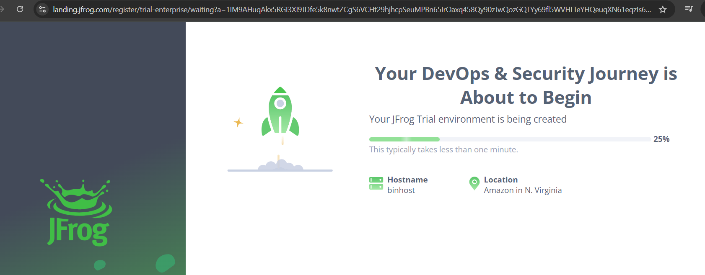

# Project-02: Create Continuous Integration Pipeline using GitHub, Jenkins, SonarCloud and JFrog

## Prerequisites

- An AWS Account
- GitHub repository with a maven based java application. You may refer to this repo for sample java app: https://github.com/kbindesh/mvn-lab-project/tree/main

## Step-01: Setup Jenkins Server (Master node)

### Step-1.1: Create an EC2 Instance and Configure as Jenkins server

- [Refer this link for step-by-step process](https://github.com/kbindesh/jenkins-masterclass/tree/main/Module-03_Setting_up_Jenkins/01-jenkins-on-amazon-linux)

### Step-1.2: Install required Jenkins Plugins

- Navigate to Jenkins dashboard >> Manage Jenkins >> Plugins >> Available Plugins
- Search and Install following plugins:
  - Maven Integration
  - Maven Invoker
  - GitHub
  - Pipeline
  - Pipeline: Stage View

## Step-02: Setup Jenkins Agent (Maven Build Server | Slave node)

### Step-2.1: Provision a Virtual Machine (EC2 Instance)

- Sign-in to AWS Account (https://console.aws.amazon.com/).
- Navigate to EC2 service >> Launch Instance.
- Name: Jenkins-Server
- AMI: Amazon Linux 2 (Kernel 5.10)
- Instance Type: t2.micro
- Key Pair: <your_existing_keypair>
- VPC/Subnet: Default
- Elastic IP: Enable
- Security Group: <create_new_sg>
  - Ingress: Allow Ingress - SSH (22) from Jenkins Master node IP
- Storage: 10 GB, GP2 (min for this lab)
- Click on Launch Instance button

### Step-2.2: Install and Configure Java

- Official link for java download: https://www.oracle.com/in/java/technologies/downloads/

```
# Switch to root user
sudo su -

# Install Java as a pre-requisites for jenkins installation
sudo yum install -y java-17-amazon-corretto.x86_64

# To verify java installation
java --version
```

- **Setup JAVA_HOME path with java home directory location**

```
find /usr/lib/jvm/java* | head -n 3
[From the preceding command, copy "/usr/lib/jvm/java-17-amazon-corretto.x86_64" path]

vi ~/.bash_profile

# Create a new variable JAVA_HOME
JAVA_HOME=/usr/lib/jvm/java-17-amazon-corretto.x86_64

# Add JAVA_HOME to the existing path
PATH=$PATH:$HOME/bin:$JAVA_HOME
```

- **Verify the Java path**

```
echo $PATH
[The preceding command will give you the updated PATH]

# In order to refresh the path
source ~/.bash_profile

# Again, display the PATH to get the updated values
echo $PATH
```

### Step-2.3: Install and Configure Maven

- Apache maven official download page: https://maven.apache.org/download.cgi

- Now, download and configure Apache Maven

```
# Move to /opt directory
cd /opt

# Download the maven binary
wget https://dlcdn.apache.org/maven/maven-3/3.9.8/binaries/apache-maven-3.9.8-bin.tar.gz

# Unzip the downloaded maven tarball
tar -xvzf apache-maven-3.9.8-bin.tar.gz

# List all the file to see the unzipped maven directory
ls -l apache-maven-3.9.8

# Get inside the maven home directory
cd apache-maven-3.9.8
```

- **Setup Maven home path | M2_HOME & M2 variables**

```
# Update the bash profile with maven path
vi ~/.bash_profile

# Create M2_HOME and M2 variable with maven location specs
M2_HOME=/opt/apache-maven-3.9.8
M2=/opt/apache-maven-3.9.8/bin

# Update the PATH variable | Add Maven path
PATH=$PATH:$HOME/bin:$JAVA_HOME:$M2_HOME:$M2

[Save the file and exit]

source ~/.bash_profile

# Verify the PATH with java and maven variables
echo $PATH
```

### Step-2.4: Install Git

```
yum install -y git
```

## Step-03: Add Maven server as an Agent on Jenkins Master node

### Step-3.1: Create a New user on Maven build server (slave) for Jenkins communication

- Connect to your Maven server (ec2 instance) over SSH.

```
# Switch to sudo user
sudo su -

# List all the existing users
cat /etc/passwd

# Create a new user
useradd jenkins

# Set the password for jenkins user
passwd jenkins

# Add the jenkins user to the sudoers file
visudo

[Press "G" to go to the end of the file and press "i" to go in insert mode]

## Allow root to run any command anywhere
root    ALL=(ALL)     ALL
jenkins ALL=(ALL)     NOPASSWD: ALL
```

- Enable password based authentication

```
vi /etc/ssh/sshd_config

[Search for PasswordAuthentication]

# Uncomment the line
PasswordAuthentication yes

# Refresh sshd service
service sshd reload
```

### Step-3.2: Add `Maven server` as an Agent (slave) on Jenkins server

- Open Jenkins Dashboard >> Nodes >> New Node
- Node Name: maven-build-server
- Permanent Agent: Enable
- `# of executors`: 5
- Remote Root Directory: /home/jenkins
- Launch Method: Launch Agent via SSH
  - Host: <private_ip_of_the_maven_server>
  - Credentials >> Add
    - Username: jenkins
    - Password: <jenkins_user_passwd_you_configured_in_prev_step>
    - ID: jenkins
  - Select the created credentials from the dropdown list.
- Host key verification strategy: Non verifying verification strategy

### Step-3.3: Verify the connection with Maven build agent

- Jenkins Dashboard >> Manage Jenkins >> Nodes >> maven_build_server
- You should see agent added without a warning sign. Also check it in the node logs.

## Step-04: Configure Maven and Java installation path on Jenkins master

- Navigate to Jenkins server dashboard >> Manage Jenkins >> Tools

- **JDK**

  - Name: Java-17
  - JAVA_HOME: /usr/lib/jvm/java-17-amazon-corretto.x86_64

- **Maven** - location of maven installation on Maven slave machine (not on Jenkins master node)
  - Name: Maven-3.9.8
  - MAVEN_HOME: /opt/apache-maven-3.9.8

## Step-05: Develop Jenkinsfile with build stages

### Step-5.1: Create a Jenkinsfile

- Launch any IDE (Visual Studio Code) on your system and open your maven project folder into it.

- Create a new file as **Jenkinsfile** and add the following code to it:

```
pipeline {

    // The agent name must match with the jenkins node name (Manage jenkins -> Nodes)
    agent {
        node {
            label 'maven-build-server'
        }
    }

    // The tool name must match with the jenkins tools (global configuration) variable names
    tools {
        maven 'Maven-3.9.8'
    }

    // Define environment variables
    environment {
        APP_NAME = "BINDESH_APP"
        APP_ENV  = "PRODUCTION"
    }

    // Cleanup the jenkins workspace before building an Application
    stages {
        // Build the application code using Maven
        stage('Code Build') {
            steps {
                 sh 'mvn install -Dmaven.test.skip=true'
            }
        }
    }
}
```

### Step-5.2: Push the Jenkinsfile into GitHub repository

```
# Stage the changes
git add .

# Commit the changes
git commit -m "Created Jenkinsfile with build stages"

// To check if the origin is pointing to the correct github repo
git remote -v

// Push the Jenkinsfile to remote github repo
git push origin main
```

## Step-06: Save GitHub Credentials on Jenkins server (Master)

- **NOTE**: Here, I'm assuming that our GitHub repository is a **Private repository**.
- Navigate to Jenkins Dashboard >> Manage Jenkins >> Credentials >> System >> Global Credentials >> New Credential
  - Kind: Username and Password
  - Username: <your_github_account_username>
  - Password: <your_github_account_password>
  - ID: github-creds

## Step-07: Create & Execute Jenkins Job (Pipeline) to build the app on Maven slave node

- Jenkins Dashboard >> New Item
  - Job type: Pipeline
  - Description: This jenkins pipeline job is responsible for building, reviewing publishing maven(java) app.
  -

## Step-08: Verify the Job execution on Maven Agent (slave) node

- Connect to your maven agent EC2 instance over SSH.
- List the jenkins workspace directory's target directory and you should see the build artifact in form of \*.jar file.

## Step-09: Setup `Github Webhook` for Jenkins server

- Navigate to your GitHub Account >> Select your repository which has the application source code >> Select **Setting** tab >> **Webhooks** >> Add Webhook
  - Payload URL: http://<your_jenkins_server_public_ip>:8080/github-webhook/
  - Content Type: application/json
  - SSL Verification: Enable SSL Verification
  - Which events would you like to trigger this webhook?: Just the push event
  - Active: Enable
  - Click **Add Webhook** button

## Step-10: `SonarCloud` integration with Jenkins

### Step-10.1: Setup SonarCloud Account

- Navigate to https://www.sonarsource.com/products/sonarcloud/ >> click on Try now button >> GitHub
- If prompted, enter your GitHub credentials to sign-in.

### Step-10.2: Generate an Authentication token on SonarCloud

- Sign-in to your SonarCloud account >> Click on your user drop-down list (top-right corner) >> My Account
- Select **Security** tab
  - **Generate Tokens**: token-for-jenkins >> click on **Generate Token** button.
  - Copy the generated token and store at save place as we'll need it in our next step.

### Step-10.3: Save SonarCloud account token on Jenkins server

- Jenkins Dashboard >> Manage Jenkins >> Credentials >> System >> Global credentials (unrestricted)
- Click on New Credentials button
  - Kind: Secret Text
  - Scope: Global
  - Secret: <paste_the_sonarqube_token_generated_in_last_step>
  - ID: sonarcloud-token
- Click on **Create** button

### Step-10.4: Install Sonar Scanner plugin on Jenkins server

- Jenkins Dashboard >> Manage Jenkins >> Plugins
- Select Available plugins tab >> serach for **SonarQube scanner** >> Select and Install

### Step-10.5: Save SonarCloud account details on Jenkins

- Jenkins Dashboard >> Manage Jenkins >> **System**.
- Scroll down all the way to **SonarQube server section** (thanks to sonarqube scanner plugin).
- Click on **Add SonarQube** button
  - Name: sonarqube-server
  - Server URL: https://sonarcloud.io
  - **Server Authentication Token**: <select_sonar_token_we_created_earlier>
- Click **Save** button

### Step-10.6: Install `SonarQube Scanner` on Jenkins server

- Jenkins Dashboard >> Manage Jenkins >> **Tools** >> Scroll to **SonarQube Scanner** section
- Click on **Add SonarQube Scanner** button
  - Name: sonar-scanner
  - Install Automatically: Enable
  - Version: <select_lastet_version>
- Click on **Apply & Save**

### Step-10.7: Create SonarCloud Organization & Project

- Sign-in to SonarCloud account >> Click on "+" button (top-right corner) >> Select **Create new organization**


- Select **Free plan** >> Click on **Create Organization** button.
- You will land-up on Projects tab. Click on **Analyze a new project** button
  

- Now, enter the requested project details:

  - Organization: bin-sonarorg
  - Display Name: bin-sonarproject
  - Project Key: <leave_it_to_default>
  - Project visibility: Public

- 

- Click Next button >> it will take you to **Set up project for Clean as You Code** page.

  - The new code for this project will be based on: Previous version
  - Click **Create project** button

- **INFO**: You will project details in the **Information** section of your SonarCloud project.

### Step-10.8: Create a sonar-project.properties file

- Move the control to your local system >> Visual Studio Code >> Open your Maven (java) project >> Create a new file **sonar-project.properties**

```
sonar.verbose=true
sonar.organization=bin-sonarorg
sonar.projectKey=bin-sonarorg_sonar-project
sonar.projectName=bin-sonarproject
sonar.language=java
sonar.sourceEncoding=UTF-8
sonar.sources=.
sonar.java.binaries=target/classes
sonar.coverage.jacoco.xmlReportPaths=target/site/jacoco/jacoco.xml
```

### Step-10.9: Add SonarCloud stage to Jenkinsfile - for code review

- Reference: https://docs.sonarsource.com/sonarqube/9.7/analyzing-source-code/scanners/jenkins-extension-sonarqube/#maven-or-gradle

- Add the following stage to the Jenkinsfile:

```
stage('SonarQube Analysis') {
  environment {
    // Tool name must match with Jenkins Tools for Sonar Scanner - Manage Jenkins >> Tools
    scannerHome = tool 'sonar-scanner'
  }
  steps {
    // Env value must match with the Sonar Server Name - Manage Jenkins >> System
    withSonarQubeEnv('sonarqube-server') {
      sh "${scannerHome}/bin/sonar-scanner"
    }
  }
}
```

### Step-10.10: Add Unit test stage to Jenkinsfile

- Add the following stage to the Jenkinsfile:

```
stage('Unit Testing Stage') {
  steps {
    sh 'mvn surefire-report:report'
  }
}

```

### Step-10.11: Add `SonarCloud Quality Gate stage` to Jenkinsfile

```
stage('Quality Gate'){
  steps {
    script {
      timeout(time: 1, unit: 'HOURS') { // In case something goes wrong, pipeline will be killed after a timeout
      def qg = waitForQualityGate() // Reuse taskId previously collected by withSonarQubeEnv
      if (qg.status != 'OK') {
        error "Pipeline aborted due to quality gate failure: ${qg.status}"
      }
    }
  }
}
```

### Step-10.12: Push the Jenkinsfile changes to GitHub repo

```
# Stage the changes
git add .

# Commit the changes
git commit -m "SonarCloud stage updates"

// To check if the origin is pointing to the correct github repo
git remote -v

// Push the Jenkinsfile to remote github repo
git push origin main
```

### Step-10.13: Verify the results both on Jenkins Server and SonarCloud

### Step-10.14: (Optional) Update the SonarCloud Quality gate if required

- SonarCloud >> Click User dropdown list (top-right corner) >> My Organizations >> Select your SonarCloud Organization

- Click Create button
  - **Name**: BIN-JAVA-QG
  - Remove all the existing conditions and add following conditions:
    - **Bugs** is greater than **50**
    - **Code Smells** is greater than **50**

## Step-11: `JFrog` integration with Jenkins

### Step-11.1: Setup JFrog Account

- Launch browser and navigate to https://jfrog.com/ >> Products >> JFrog Artifactory >> Start Free
- If you have a google account, click on Google button and enter the credentials to login >> Continue.
- After login, it will take you to your JFrog Account's **Get Started** page >> Click on **Start Trial** button.
  - Hostname: binhost
  - Company:
  - Hosting preferences: AWS
  - Cloud Region: N.Virginia



- You will see the confirmation message on the screen saying your "Your JFrog account is ready".
- Click on Sign-in option >> Enter your google credentials to Sign-in to JFrog account.

### Step-11.2: Create JFrog authentication token

- JFrog Dashboard >> Administration tab >> User Management >> **Access Token**.
  

- Click on **Generate Token** button.
  - Scoped Token: Enable
  - Description: Token for Jenkins integration
  - Token Scope: Admin
  - Username: <should_be_your_gmail_id> (e.g. bindesh@gmail.com)
  - Service: All
  - Expiration Time: 3 days
  - Click on Generate button.

### Step-11.3: Save the generated JFrog token on Jenkins server

- Jenkins Dashboard >> Manage Jenkins >> Credentials >> System >> Global Credentials >> Add Credentials
  - Kind: Username and Password
  - Scope: Global
  - Username: <jfrog_username>
  - Password: <jfrog_access_token_generated_in_last_step>
  - Click on **Create** button

### Step-11.4: Install Artifactory (JFrog) plugin on Jenkins server

- Jenkins Dashboard >> Manage Jenkins >> Plugins >> Available plugins tab >> Search Artifactory >> Install.

### Step-11.5: Add `Artifactory stage` to Jenkinsfile

- Reference: https://jfrog.com/help/r/jfrog-integrations-documentation/working-with-pipeline-jobs-in-jenkins

### Step-11.6: Add a stage to publish build artifacts (\*.jar) to JFrog Artifactory

```
def registry = 'https://binhost.jfrog.io'
stage("Jar Publish") {
  steps {
    script {
      echo '<--------------- Started Publishing Jar --------------->'
        def server = Artifactory.newServer url:registry+"/artifactory" ,  credentialsId:"artifactory_token"
        def properties = "buildid=${env.BUILD_ID},commitid=${GIT_COMMIT}";
        def uploadSpec = """{
            "files": [
              {
                "pattern": "jarstaging/(*)",
                "target": "libs-release-local/{1}",
                "flat": "false",
                "props" : "${properties}",
                "exclusions": [ "*.sha1", "*.md5"]
              }
            ]
        }"""
        def buildInfo = server.upload(uploadSpec)
        buildInfo.env.collect()
        server.publishBuildInfo(buildInfo)
        echo '<--------------- Jar Published Successfully --------------->'
    }
  }
}
```

### Step-11.7: Push the updated Jenkinsfile to GitHub and execute Jenkins Job

```
# Stage the changes
git add .

# Commit the changes
git commit -m "Jfrog artifactory stage updates"

// To check if the origin is pointing to the correct github repo
git remote -v

// Push the Jenkinsfile to remote github repo
git push origin main
```

### Step-11.8: Verify the results on Jenkins and JFrog

- On Jenkins server, check the build logs.

- On Jfrog account, click Artifactory >> libs-release-local >> follow your project heirarchy and you will find your artifacts over there.
